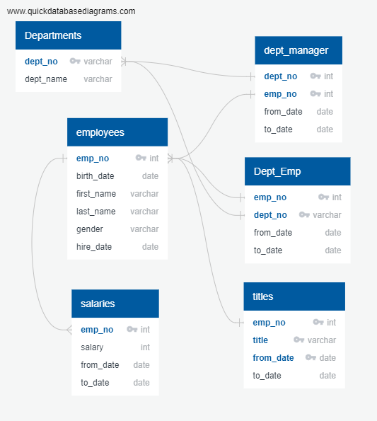
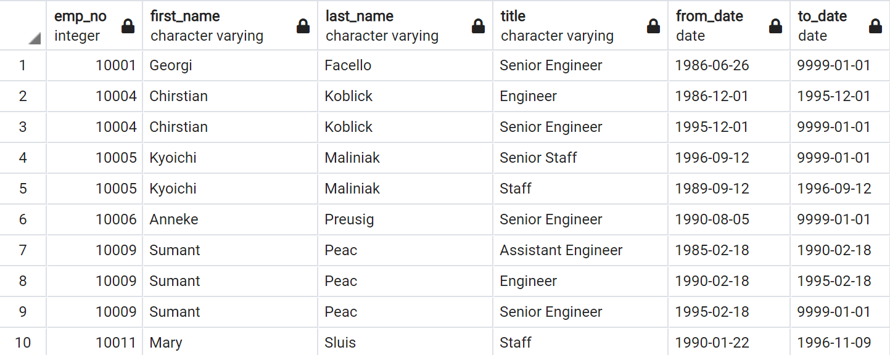
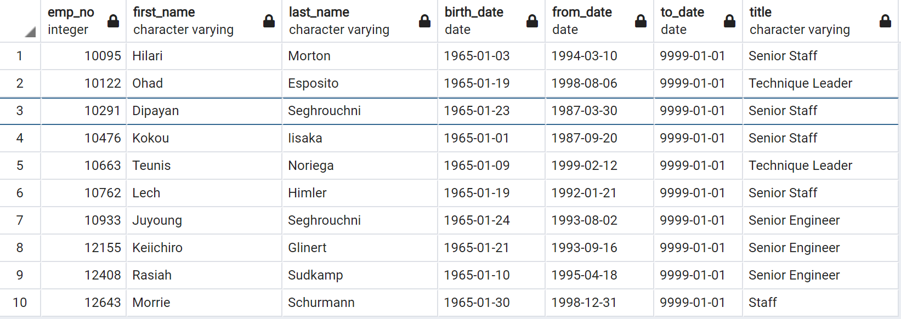
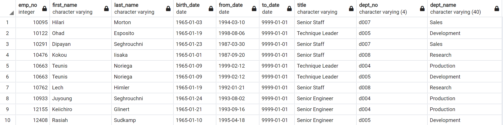

# Pewlett-Hackard-Analysis with PostgreSQL (SQL)

## Overview of Project/Purpose
With many types of versions available for SQL, this week's module
focused on PostgreSQL, an open source object-relational database system.
Within the assignment, the task is meant to help an HR analyst look ahead
and plan retirement packages as well as anticipate future job openings.
By building an employee database with SQL, it's meant to
address the following questions in our analysis:
1) Who will be retiring?
2) How many job titles need to be filled?

---
## Summary: Analysis/Results

In the assignment, we we're tasked to query the tables to (1) determine 
the number of retiring employees per title and (2) identify employees
who were eligible to participate in a mentorship program.

In order to query the tables, there were many prior steps taken 
to build the tables. First, we designed an ERD (Entity Relationship Diagram)
using QuickDBD (https://app.quickdatabasediagrams.com/#/) to create an outline
of what tables to build and what columns/datatypes will fill them.
In addition, we assigned primary and foreign keys to help when joining tables.
Next, we created the SQL database according to our outline and imported
6 different csv files into pgAdmin to populate as data. Then, by using
different joins with the 6 tables, we were able to create new tables and query using different
SQL statements to answer our analysis questions. 

Creating the following ERD, it reflects the different table relationships.

1. In Deliverable 1, the first query was to pull the titles of employees
eligible for retirement. Criteria for retirement means the employee was
born between January 1, 1952 and December 1, 1955. Hence, in the query,
I indicated the "birth_date" in the `WHERE` clause. Next, since title
doesn't exist in the employee table, I had to `INNER JOIN` the **titles** table.
Next, to get my merged table, I used the `INTO` function to create the 
**retirement_titles** table.

>

>

2. Reviewing the **retirement_titles** table, we'll see that some employees
have several entries as they may have switched titles over the years. To 
retrieve the most current title, `DISTINCT ON` was used `ON (emp_no)`. In
addition, the `DISTINCT ON` retrieves the first record it sees on the list;
so the `ORDER BY` is important to include to ensure you're grabbing the entry
you want. Here, we're ordering by "emp_no" and "to_date". Again, we used the
`INTO` function to create a new table: **unique_titles**. In the example, notice how employee no 10004 now has only 1 record available whereas previously
employee had 2.

>
>

3. Finally, in order to see how many employees are retiring per title, we'll
use the `COUNT` function in our query. Here we are grouping by the "title"
column. Using `INTO`, the final table, **retiring_titles** is created and 
answers the first question. It shows how many employees are retiring by title. 

>
>

>In total, there 90,398 employess retiring who were born between 1952 and 1955.
The company will be retiring 29,414 Senior Engineers and will require the most
effort to back-fill the roles. In addition, 31% of retiring employees are
Senior Staff employees (28,254) and will require as much effort to fill the
positions. Other titles are lower in volume, but overall, HR is looking
to hire quite a few new employees or possibly even consider some promotions.

4. In Deliverable 2, we're only writing one query to identify employees eligible
for a mentorship program. Here we are combining 3 different tables to create 1 final
table using `INNER JOIN` and linking `ON` emp_no. Within the `WHERE` clause,
we only want the current employees so we filter using "to_date". In addition,
one of the criteria was the mentors to be born in 1965, hence, "birth_date"
has been added to the `WHERE` clause. Again, multiple titles will appear
for some employees, so the `DISTINCT ON` was included to pull the most recent
title for the employee. Our final table was created `INTO` the 
**mentorship_eligiblity** table. Reviewing the table, it identfies all 
the employees eligible to participate in the mentor program.

>

Additional code was written to get the number of eligible mentors by title. 
>

In total, there were 1,549 eligible mentors. Using this query: `SELECT COUNT(*) FROM mentorship_eligibility;`
it confirms the total of employees qualified to be a mentor.

### Additional Codes

Completing the deliverables, there were other questions that came to light.
As such, additional queries were written to address them.

*How many roles will need to be filled as the "silver tsunami"
begins to make an impact?*

* Again, using a combination of the `SUM` and `COUNT` function, I'm able 
to query the total number of employees eligible to retire: 
`SELECT SUM(COUNT) FROM retiring_titles;`  
The results will show there are 90,398 retiring employees and will
need to be filled. The query used in Deliverable 1 or using the
**retiring_titles** table will provide the breakdown of those retiring employees
by title.

*Are there enough qualified, retirement-ready employees in the departments to mentor 
the next generation of Pewlett Hackard employees?*

* In order to arrive to this answer, it required a few queries. 
First, we are considering retirement ready employees eligible to mentor.
So, the first criteria to consider is the base table, which in this case
would be the **mentorship_eligibility** because this provides all eligible
mentors (born in 1965 & currently employed). Next, we want to see the departments linked
to these employees. Our **mentorship_eligibility**
does not have either dept_name or dept_no to connect to the **departments table**.
Referencing the ERD, I pull in the "dept_no" from the **dept_emp** table by using
`INNER JOIN` on "emp_no". Next, I can use the "dept_no" from the **dept_emp** table
to get the dept_name. So the next step in the query uses `INNER JOIN` on "dept_no".

In addition, I noticed that some employees were part of more than one department,
so again, I used the `DISTINCT ON` function to only get one record. Notice I used
`INTO TEMP TABLE` because I didn't want to create these tables for the database.
Rather by using temp, it gives me the flexibility to query without having it stored
in my database, saving memory for my DB.

Finally, I use the `COUNT` function to see how many eligible mentors
exists in each department. Here we see there should be enough employees
in each department to serve as a mentor.

>
>

---
### Conclusion - Challenges

Overall, I am familiar with SQL Server and using PostgreSQL took
some time to figure out the switch between the two. As with any
environment, there are pros and cons to both. 

Based on my understanding `DISTINCT ON` is unique to postgreSQL and
posed a few challenges along the way. 

(1) In the first deliverable, when creating the unique_titles, it seemed
that for some employees they had more than one current title. For
example, employee no 94870 became problematic. It seems that in the
titles table, this specific employee had a senior title for one day and is showing
two titles for the same "to_date" in the data. Thus, the `DISTINCT ON`
function pulls the first row, which in this case is Engineer. Hence,
this is the title that populates in the final table.  

(2) Experiencing a similar issue, in Deliverable 2, a specific employee
title was not matching the image noted in the challenge. It was a
debate between whether employee no 10291 was either Staff or Senior Staff.
According to the **titles** table, this employee's current title is Senior Staff,
which is what our code generates. The issue was the mismatch of our results
to the module.

After a lengthy discussion with peers and instructors, the solution was to move
forward with our code and the module images shouldn't be a benchmark to our solution.
Knowing this is unique to postgreSQL, these are notes to keep in mind for 
future queries alongside ensuring the original datatables have no anamolies in the data.
Furthermore, despite these hurdles, I believe this expanded exposure
to other SQL environments is beneficial to my skill set.
